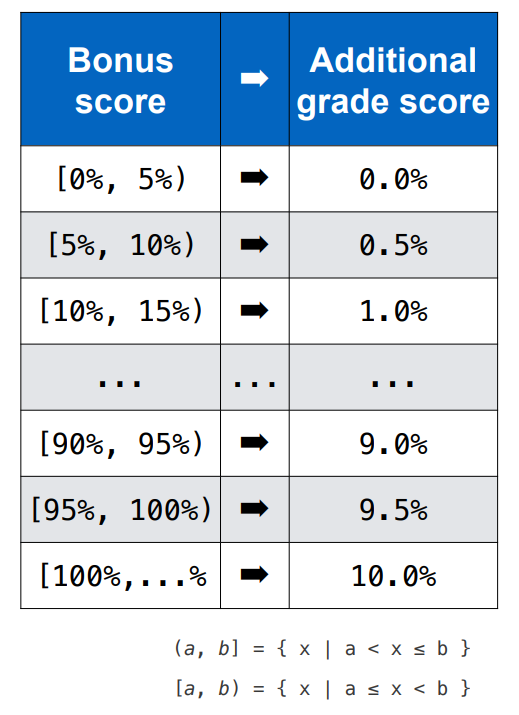

This is the space for our pre-course preparation materials

***
Below is a possible grading system and some introduction of Artemis
***

****Tools****

**Whatsapp**

[QR code](https://artemis.cit.tum.de/)

• Discuss with other students

• Read announcements

• Ask questions about the general organization

• Post questions and answers related to specific lectures and exercises

**Artemis**

[https://artemis.cit.tum.de/](https://artemis.cit.tum.de/)

• Download PDF slides before the lecture starts

• Participate in exercises: programming, modeling, quiz, text

• Review your individual exercise results including feedback

***

****Possible Grading System****

| **Activity**                            | Weight    |
|-----------------------------------------|-----------|
| Intermediate project                    | 30%       |
| Presentation(Homework + tutor exercise) | 10%       |
| Final Project                           | 60%       |
| **Total**                               | 100%      |
| Bonus for selected homework exercise    | up to 10% |

**Bonus System**

Participate in lecture and homework exercises to receive points

Exercises are marked with a bonus category

other (non-bonus) exercises are marked as optional

**Mapping of bonus to additional grade score**

****Exercise types****

1. Lecture exercises(e.g.L01E01)
   1. solve exercise during the lectures
2. Group exercises(e.g.T01E01)
    1. solve exercise in a group during the tutor group meeting
   2. presented in the tutor groups
   3. perpare for homework exercises and for the final exam
3. Homework exercises(e.g.H01E01)
    1. published after each lecture : to be solved within one week at home
    2. Assessed automatically(real time feedback)
    3. presented and discussed in the subsequent tutor group

****Assessment and complaints****
• Artemis uses double blind assessments to improve the fairness

• The tutor does not know the identity of the student

• The student does not know the identity of the tutor

• If you think the assessment is wrong, you can complain on Artemis

